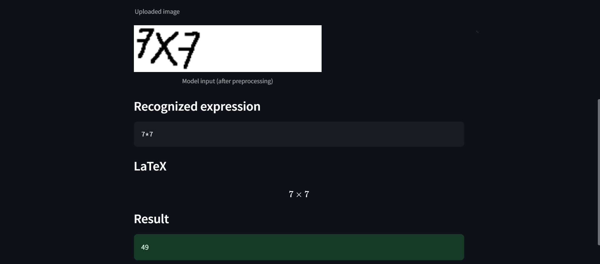
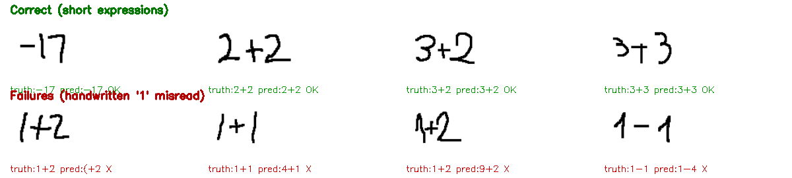
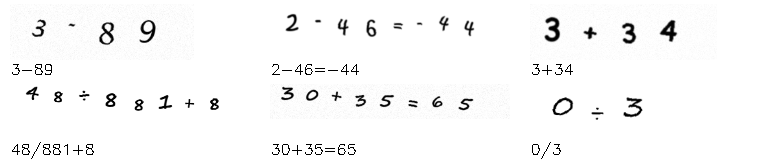
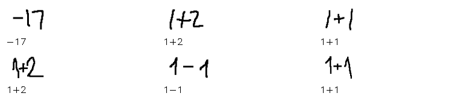

# 🧮 Handwritten Math Solver (CRNN + CTC)

[](https://github.com/prakhar-189/Math-Solver-DeepLearning/actions/workflows/ci.yml)

An end-to-end deep learning system that reads a **handwritten flat arithmetic expression** from an image and solves it. A CRNN (CNN + BiLSTM) trained with CTC recognizes the expression as a character string; SymPy evaluates it.



*Real handwritten `7×7` → recognized as `7*7` → solved to `49`.*

---

## 🎯 Scope (read this first)

This model recognizes **flat, left-to-right arithmetic** only: digits, `+ - × ÷ ( ) .` and `=`.
It does **not** handle fractions, exponents, subscripts, or algebra.

That scope is a deliberate, load-bearing decision, not laziness — see the next section.

---

## 🧨 The lesson that shaped this project

An earlier version of this project tried to train on the **CROHME** handwritten-math dataset and failed (severe overfitting, an app that produced garbage). Rebuilding it, I measured *why*:

- CROHME is **~70% two-dimensional notation** — fractions (`\frac`), exponents (`^`), subscripts (`_`), roots (`\sqrt`). A CTC model reads a **1-D left-to-right sequence** and structurally cannot represent 2-D layout. It was being asked to do something impossible.
- Filtering CROHME to the flat arithmetic a CTC model *can* handle leaves only **~233 expressions across all four CROHME splits combined**, most of them near-duplicates like `1+1=2`. That is nowhere near enough data — hence the overfitting.

So the fix was twofold: **(1) narrow the scope to flat arithmetic** (what the architecture can actually do), and **(2) generate unlimited synthetic training data** for that scope, while keeping the real CROHME flat-arithmetic samples as an honest held-out test set.

---

## 📊 Results (real, measured)

Trained on **8,000 synthetic** images, validated on **1,500 synthetic**, and tested on **330 real handwritten** CROHME flat-arithmetic images the model never saw.

| Set | Exact-match | Char accuracy (1 − CER) |
|---|---|---|
| Synthetic validation | **99.5%** | 99.9% |
| Real CROHME test (automated, ≤24-char subset, n=298) | **17.5%** | ~63% |

The **99.5% synthetic** result proves the architecture and pipeline genuinely learn the task. The **real-handwriting number is the honest synthetic→real domain gap** — and breaking it down is where the interesting findings are.

### Accuracy by expression length (full 330-image real test set)

| Expression length | n | Exact-match |
|---|---|---|
| 1–3 chars | 88 | **40.9%** |
| 4–6 chars | 71 | 11.3% |
| 7–10 chars | 55 | 7.3% |
| 11+ chars | 116 | 3.4% |
| **Overall** | **330** | **15.8%** |

Exact-match is unforgiving (one wrong character fails the whole expression), and 35% of the real set is long, nested expressions (11+ chars) the synthetic data never covered. On **short expressions the model reaches ~41%** on genuinely unfamiliar handwriting.

### The dominant error: the handwritten digit `1`

Among same-length mistakes, one confusion dwarfs all others:

| Confusion (truth → predicted) | Count |
|---|---|
| `1` → `4` | 50 |
| `2` → `8` | 19 |
| `9` → `8` | 11 |
| `1` → `9` | 9 |
| `1` → `)` | 8 |
| `1` → `7` | 7 |
| `.` → `-` | 6 |

**The digit `1` alone accounts for the majority of errors.** People write `1` as a bare vertical stroke; the handwriting *fonts* used to generate training data draw it with a distinctive flag/serif. The model never learned the "vertical bar = 1" convention, so it guesses `4`, `9`, `)`, `7`… You can see it directly:



*Top: correct on short real expressions. Bottom: every failure is a `1` written as a plain vertical stroke.* This is a concrete, actionable finding — the single highest-leverage fix would be augmenting the `1` glyph (or mixing in a few hundred real `1` samples), not a bigger model.

Full metrics: [`eval_metrics.json`](eval_metrics.json), reproducible via `python -m training.training_crnn`.

---

## 🖼️ Data

| Synthetic training data (fonts + augmentation) | Real CROHME test data (human handwriting) |
|---|---|
|  |  |

- **Synthetic** ([data/generate_synthetic.py](data/generate_synthetic.py)) — flat arithmetic rendered character-by-character with 9 handwriting fonts, per-glyph rotation/size/baseline jitter, and stroke-thickness/blur/noise augmentation. Multiplication/division are drawn as `×`/`÷` but labeled `*`/`/` so results stay SymPy-evaluable. Regenerable, unlimited, balanced.
- **Real test** ([data/build_real_testset.py](data/build_real_testset.py)) — the flat-arithmetic subset of CROHME, normalized to the same character vocabulary. Images not redistributed (CROHME license); rebuild from your own CROHME copy.

---

## 🏗️ Architecture

```
image (64×256×1)
   │
   ▼  CNN feature extractor (4 conv blocks + BatchNorm + pooling)
   │
   ▼  reshape to a width-major sequence  (64 timesteps × features)
   │
   ▼  Dense + Dropout → BiLSTM(64) → Dropout → BiLSTM(64)
   │
   ▼  Dense → logits (18 chars + CTC blank)
   │
   ▼  CTC greedy decode → "7*7"
   │
   ▼  SymPy → 49
```

- **CRNN + CTC**: the CNN reads visual features, the BiLSTMs model left-to-right sequence, and CTC aligns the variable-length output to the image without needing per-character bounding boxes.
- **~573k parameters (2.2 MB)** — deliberately small; the task is constrained and a big model would just overfit.

---

## 🐛 Real bugs / design flaws fixed in the rebuild

- **Train/inference preprocessing mismatch (the core reason the old app produced garbage):** training and inference ran *different* image-preprocessing paths, so the model was served a distribution it had never trained on. There is now **one** `utils.preprocess_image` used by training, evaluation, and inference — with polarity normalization (real CROHME is white-on-black, synthetic is black-on-white) and crop-to-ink, verified by a unit test.
- **No validation signal:** the old training loop monitored *training* loss only, so overfitting was invisible. Now there's a real validation split with val-monitored EarlyStopping / ReduceLROnPlateau / best-checkpointing.
- **Wrong dataset for the architecture:** documented above — swapped doomed CROHME-only training for scoped synthetic generation.
- **`eval()` on model output in the webcam app** (arbitrary code execution risk) → replaced with SymPy.
- **Dead, misleading code** (`transformer_model.py`, never wired in) removed; requirements pinned; CTC loss/decode semantics verified against this Keras version before the training run.

---

## 🚀 How to run

```bash
git clone https://github.com/prakhar-189/Math-Solver-DeepLearning.git
cd Math-Solver-DeepLearning

python -m venv venv
venv\Scripts\activate            # source venv/bin/activate on Linux/Mac
pip install -r requirements.txt

# 1. Generate synthetic data + build the real test set (needs a local CROHME copy)
python data/generate_synthetic.py
python data/build_real_testset.py --crohme-dir <path-to-CROHME>

# 2. Train (writes math_solver_crnn.keras + eval_metrics.json)
python -m training.training_crnn

# 3. Run the app
streamlit run streamlit_app.py
```

### Tests
```bash
pip install -r requirements-dev.txt
pytest tests/ -v      # preprocessing, CTC decode semantics, and solver correctness
ruff check .
```
CI runs both on every push/PR.

---

## ⚠️ Limitations & next steps

- **Synthetic→real gap** is real and quantified above. The **highest-leverage fix is the digit `1`** (augment its glyph or add real samples), followed by broadening augmentation to better mimic real strokes.
- **Long / nested expressions (11+ chars)** are largely unsolved — they were rare in the synthetic distribution and push against the 64-timestep budget. Generating longer synthetic expressions would help.
- **Flat arithmetic only** by design. Fractions/exponents/algebra need a fundamentally different model (an image-to-LaTeX **encoder-decoder / attention transformer**), which is the honest next architecture, not a bigger CRNN.
- The webcam mode is best-effort (real backgrounds are harder than clean scans).

---

## 🛠️ How this project was rebuilt

I was stuck on this project for **months** — it overfit badly, the dataset never felt right, and the Streamlit app just wouldn't work. I rebuilt it with **[Claude Code](https://www.anthropic.com/claude-code)** as a pair-programmer: working through the root causes together (a CTC model structurally can't read CROHME's 2-D notation, a train/inference preprocessing mismatch, and no validation signal to catch overfitting), regenerating the data as synthetic handwriting, retraining, and fixing the bugs.

I've kept this README honest about what was actually broken and how each issue was fixed — including the failure modes that remain — rather than pretending it worked on the first try.

---

## 👤 Author

**Prakhar Srivastava** — [github.com/prakhar-189](https://github.com/prakhar-189)
